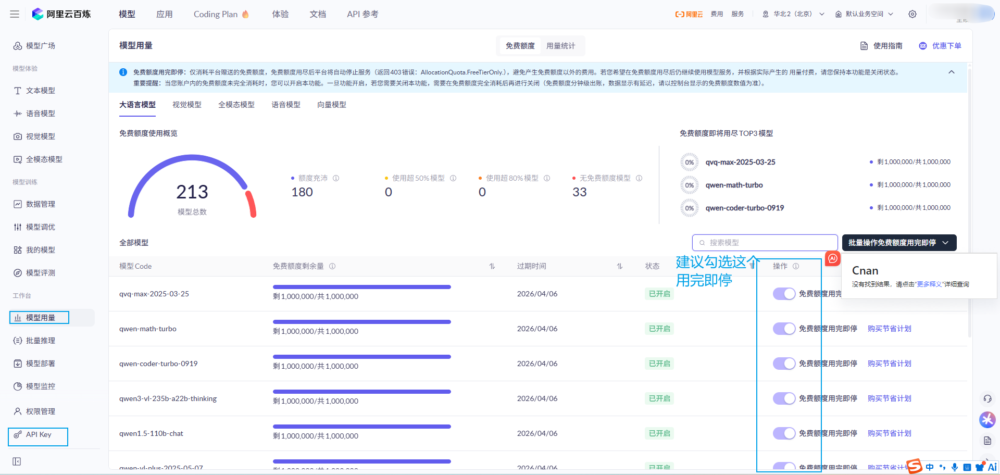
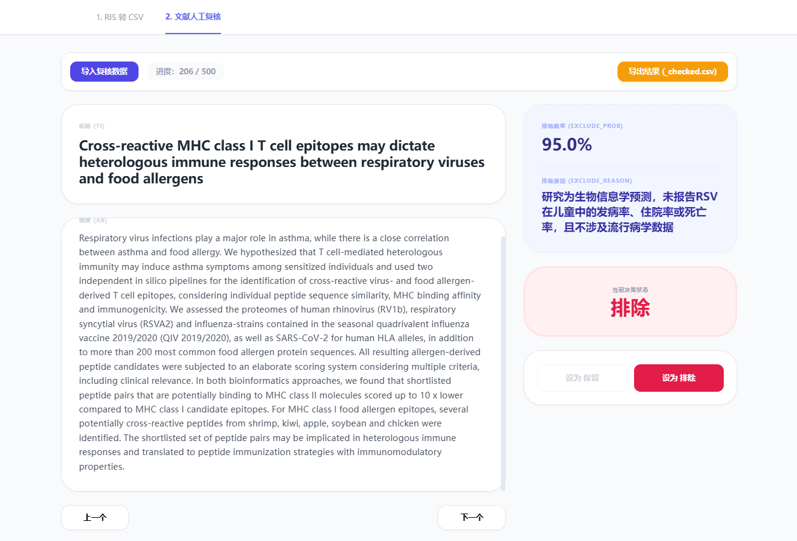

# Meta_AI

基于大语言模型的 **RSV 儿童流行病学 Meta 分析文献初筛** 辅助工具。使用 R 调用阿里云 DashScope（通义千问）接口，对文献标题与摘要按预设规则生成 `exclude`、`exclude_prob`、`reason` 等结构化结果，并写入 `rda/` 下的 CSV 便于后续整理。

## 目录说明

| 路径 | 说明 |
|----|----|
| `code.R` | 主脚本：构建提示词、调用 API、解析 JSON、循环处理与分块导出 |
| `Data/` | 原始文献表（如 `Global_health_*.csv`） |
| `rda/` | 处理中间结果与按行号切分的导出 CSV |
| `tools.html` | 浏览器端「文献处理工具箱」（见下文） |
| `阿里云模型.png` | 百炼 / API Key 相关操作说明配图 |
| `Meta_AI.Rproj` | RStudio 项目文件 |

## 环境依赖

在 R 中安装并使用：`httr`、`jsonlite`、`dplyr`、`purrr`、`readr`。

运行前请在 `code.R` 中配置有效的 DashScope API Key（建议改为从环境变量读取，**勿将密钥提交到版本库**）。

### 阿里云百炼与 API Key

-   控制台与 API 文档入口：[阿里云百炼（DashScope）](https://bailian.console.aliyun.com/cn-beijing?tab=api#/api)\
-   获取 API Key 的步骤还可对照仓库中的说明配图 **`阿里云模型.png`**（若本地文件名略有不同，以你目录里实际 PNG 为准）。
-   建议在控制台勾选 **免费额度用完即停**，避免超额产生费用。

**文本模型**：作者在本项目中使用的是通义千问文本生成模型，即 `code.R` 第 34–36 行注释中的三种：`qwen-plus-2025-07-28`、`qwen-plus`、`qwen-flash`。

## 使用提示

1.  按脚本注释准备数据框（含标题 `TI`、摘要 `AB` 等），生成 `prompt` 列后执行循环调用。
2.  模型与温度等参数在 `call_qwen()` 内可调；断点续跑可通过判断 `raw_text` 是否已非空跳过已处理行。
3.  大规模批处理请注意 API 配额、费用与请求频率限制。

## 文献处理工具箱（`tools.html`）

在资源管理器中双击打开，或用浏览器直接打开该 HTML 文件即可使用（依赖 CDN 加载 React、Tailwind、PapaParse、SheetJS 等，**需能访问外网**；数据在本地浏览器中处理，不会自动上传到本项目服务器）。

页面顶部有两个标签页：

**1. RIS 转 CSV**\
- 导入 EndNote 等导出的 `.ris` 文件，按 RIS 标签解析记录；同一标签多次出现（如多位 `AU`）会自动合并为一条字段。\
- 点击「开始转换预览」后可在页面中预览**前 50 条**；「导出 CSV」生成带 **UTF-8 BOM** 的文件，便于 Excel 正确显示中文。

**2. 文献人工复核**\
- 导入 `code.R` 跑批后的 **CSV** 或 **Excel（.xlsx）**。程序会识别标题列 **`TI` / `Title`** 与摘要列 **`AB` / `Abstract`**（大小写不敏感）。\
- 右侧展示模型给出的 **排除概率**（`exclude_prob` 或 `prob`）与 **原因说明**（`reason`、`exclude_reason` 等兼容列名）；初始「保留/排除」会尽量读取已有 **`exclude` / `EXCLUDE`** 列。\
- 通过「上一个 / 下一个」逐篇浏览，用「设为 保留 / 设为 排除」覆盖当前条目的**人工决策**；「导出结果」得到 **`{原文件名}_checked.csv`**，其中 `exclude` 列为最终人工裁定（`0` 保留，`1` 排除），其余列一并保留。

该页面与 `code.R` 衔接：**RIS → CSV** 可作建库/对齐字段的前置步骤；**人工复核** 用于在 AI 初筛后对每篇文献做正式核对并导出可追溯结果。

------------------------------------------------------------------------

## 重要声明：AI 输出仅作辅助，不能代替人工核查

**本项目中的模型输出（含排除建议、概率、理由及任何衍生字段）仅供研究流程中的初步参考与效率辅助。**

-   **不得**将 AI 判断作为纳入/排除的最终依据，**必须**由具备相应专业背景的研究者依据正式方案、原始全文与团队共识进行复核。
-   模型可能产生遗漏、误判、格式错误或不符合方案口径的表述；对法规、伦理、发表与临床决策相关结论，**一律以人工审核为准**。
-   使用方对基于本工具结果所做的任何决定与后果自行负责；请在论文或报告中如实说明筛查流程及人工复核环节。

------------------------------------------------------------------------

如在协作或二次开发中引用本仓库，请同步告知合作者上述限制，避免将「模型标签」误解为已完成的系统评价筛选结论。

